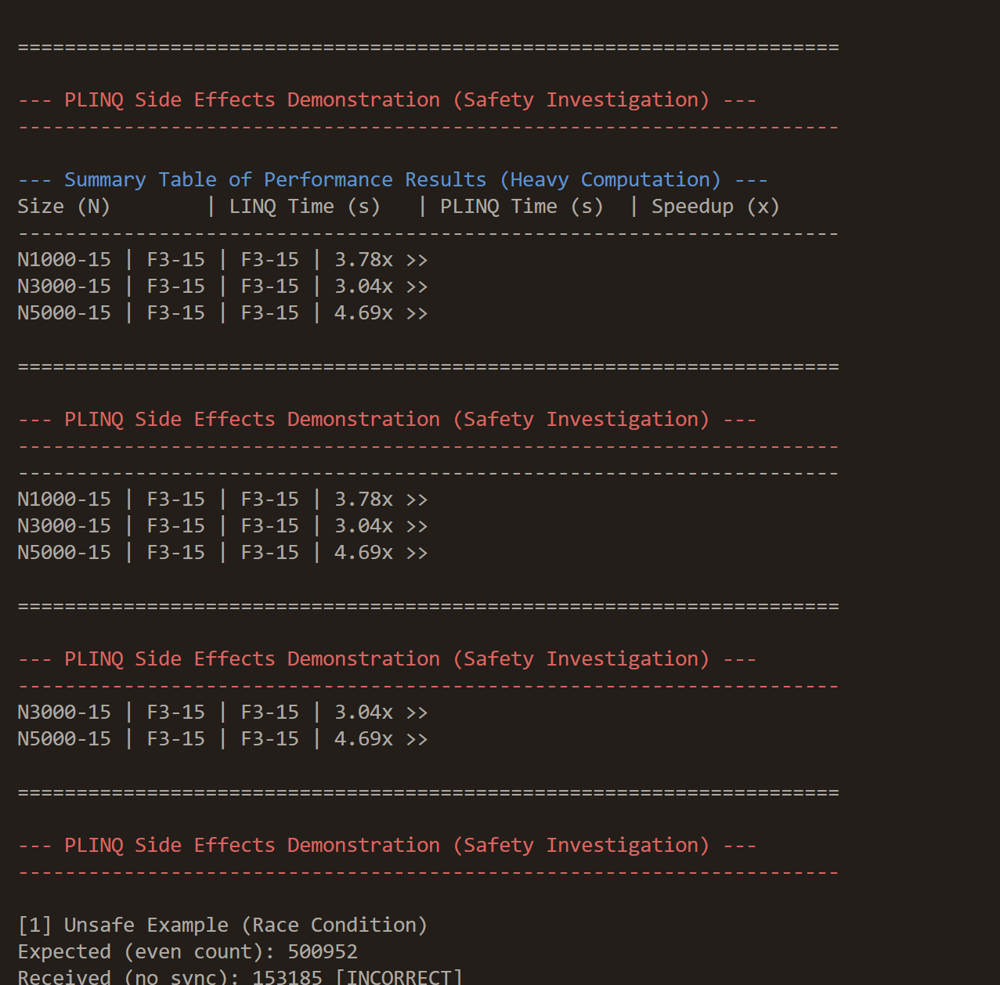
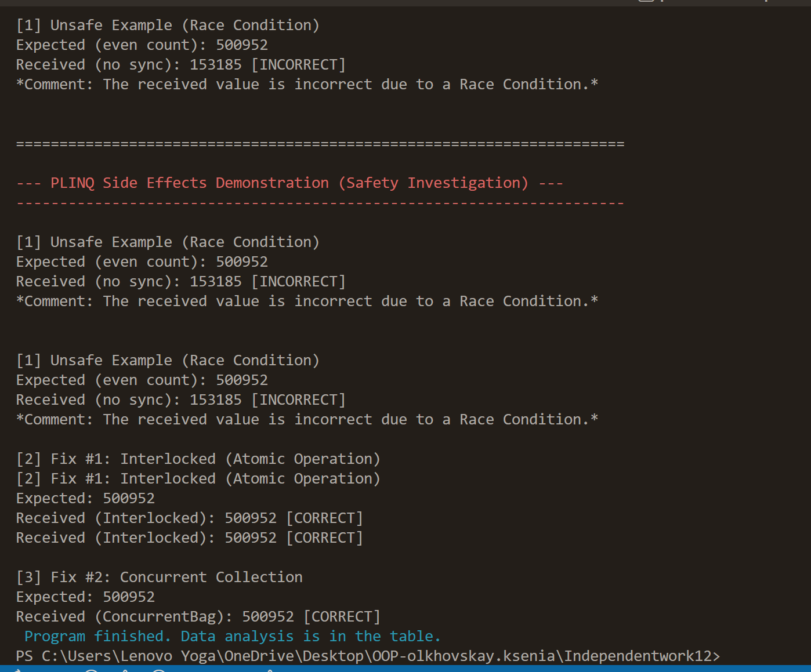

Самостійна робота №12 
Тема: PLINQ: дослідження продуктивності та безпеки. 
Мета: Дослідити переваги та недоліки PLINQ (Parallel LINQ) у порівнянні зі звичайним LINQ, виміряти його продуктивність на різних обсягах даних та проаналізувати потенційні проблеми безпеки при паралельній обробці. 
## Особливості коду
- Генерує великі колекції випадкових чисел (`List<int>`) з розмірами 1M, 3M та 5M елементів.
- Виконує обчислювально інтенсивну операцію для кожного елемента:
  - Перевірка на просте число.
  - Математичні обчислення: sqrt, log, sin.
- Порівнює **LINQ** та **PLINQ** за часом виконання.
- Виводить підсумкову таблицю з розмірами колекції, часом LINQ, PLINQ і прискоренням.
- Демонструє побічні ефекти у PLINQ та способи їх усунення:
  - `UnsafePlinqSideEffect` — race condition (непотокобезпечний код).
  - `FixedWithInterlocked` — потокобезпечний лічильник через Interlocked.
  - `FixedWithConcurrentCollection` — потокобезпечне збирання через ConcurrentBag.
  
  
  