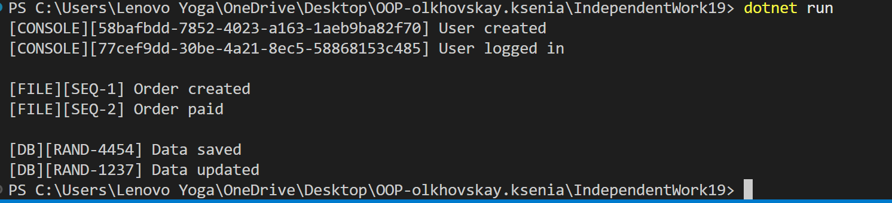

# IndependentWork19

## Тема
Фабрики + Singleton: заміна без змін клієнта.

##  Варіант 12
Система генерації ID: IIdGenerator (Guid, Sequential, Random), IdGeneratorFactory,
IdService (Singleton).

##  Мета роботи
Навчитися використовувати патерни Factory Method та Singleton для створення гнучкої системи, де компоненти можна змінювати без зміни клієнтського коду.

##  Опис реалізації
Проєкт реалізує:

### 1. Генерацію ID
Інтерфейс:
- IIdGenerator

Реалізації:
- GuidIdGenerator
- SequentialIdGenerator
- RandomIdGenerator

Фабрики:
- IdGeneratorFactory
- GuidIdGeneratorFactory
- SequentialIdGeneratorFactory
- RandomIdGeneratorFactory

Singleton:
- IdService — відповідає за генерацію ID

---

### 2. Система логування

Інтерфейс:
- ILogger

Реалізації:
- ConsoleLogger
- FileLogger
- DatabaseLogger

Фабрики:
- LoggerFactory
- ConsoleLoggerFactory
- FileLoggerFactory
- DatabaseLoggerFactory

Singleton:
- LoggerManager — керує логуванням

##  Взаємодія

Система поєднує генерацію ID та логування:

- Кожен лог містить унікальний ID
- ID генерується через IdService
- Логування відбувається через LoggerManager

Це дозволяє:
- змінювати тип ID
- змінювати тип логування  
- без зміни клієнтського коду

## Демонстрація роботи

1. Використовується Guid + ConsoleLogger  
2. Потім Sequential + FileLogger  
3. Потім Random + DatabaseLogger  

Фабрики змінюються динамічно під час виконання.

## Використані патерни

### Factory Method
Дозволяє створювати об'єкти через абстракцію, не прив'язуючись до конкретних класів.

**Переваги:**
- гнучкість
- розширюваність
- відповідність принципу OCP

### Singleton
Гарантує, що існує лише один екземпляр класу.
**Використання:**
- LoggerManager
- IdService

## Контрольні питання

### 1. Поясніть патерн Factory Method. Які проблеми він вирішує?
Це патерн, який визначає інтерфейс для створення об’єктів, але дозволяє підкласам вирішувати, який саме клас створювати.

Він вирішує проблему жорсткої прив’язки до конкретних класів.

### 2. Поясніть патерн Singleton. Коли його доцільно використовувати, а коли варто уникати?
Це патерн, який гарантує існування лише одного екземпляра класу.

**Коли використовувати:**
- для спільних сервісів (логування, конфігурація)

**Коли уникати:**
- коли потрібна гнучкість або тестування

### 3. Як ці два патерни можуть працювати разом для створення гнучкої та контрольованої системи?
Factory створює об’єкти, а Singleton керує їх використанням.
Це дозволяє централізовано змінювати поведінку системи.

### 4. Які переваги дає використання абстракцій (інтерфейсів) у поєднанні з Factory Method та Singleton?
- слабка зв’язаність (low coupling)
- легка заміна реалізацій
- масштабованість
- зручне тестування

## Висновок
Було реалізовано систему генерації ID та логування з використанням патернів Factory Method та Singleton. Система дозволяє змінювати компоненти без зміни клієнтського коду, що відповідає принципу Dependency Inversion.