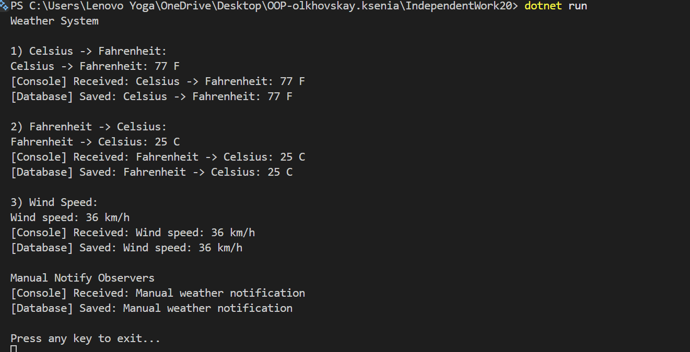

# IndependentWork20 — Weather System

## Опис проєкту
Цей проєкт реалізує систему обробки погодних даних з використанням патернів проектування:

- **Strategy** — для зміни алгоритму обробки даних під час виконання
- **Observer** — для автоматичного сповіщення підписників про зміни
- **DI (Dependency Injection)** — для розділення відповідальностей між компонентами

##  Реалізовані патерни

### Strategy
Дозволяє змінювати алгоритм обробки даних без зміни клієнтського коду.

Реалізовано стратегії:
- CelsiusToFahrenheitStrategy
- FahrenheitToCelsiusStrategy
- WindSpeedConverterStrategy

### Observer
Забезпечує механізм підписки та сповіщення об'єктів про події.

Реалізовано спостерігачі:
- ConsoleOutputObserver
- WeatherDatabaseObserver

### Dependency Injection
ProcessingService отримує залежності через конструктор, що підвищує гнучкість системи.

## Демонстрація роботи


## Відповіді на контрольні питання
### 1. Поясніть патерн Strategy. Як він дозволяє змінювати поведінку об’єкта під час виконання?
Патерн Strategy — це поведінковий шаблон проєктування, який дозволяє визначати сімейство алгоритмів, інкапсулювати кожен із них і робити їх взаємозамінними.Він дозволяє змінювати поведінку об’єкта під час виконання програми без зміни його коду, оскільки алгоритм винесений в окремі класи.Замість умовних конструкцій використовується підміна стратегії через інтерфейс.

У моєму проєкті змінюється спосіб обробки погодних даних (температура / вітер) через DataContext.
### 2. Поясніть патерн Observer. Як він забезпечує слабке зв’язування між суб’єктом та спостерігачами?
Observer — це поведінковий патерн, який створює залежність “один-до-багатьох”, де зміна стану одного об’єкта автоматично сповіщає всі залежні об’єкти.

Слабке зв’язування досягається тим, що:

- Publisher не знає конкретних спостерігачів
- спостерігачі можуть додаватися або видалятися без зміни Publisher

 Це робить систему гнучкою та розширюваною.
### 3. Як події та делегати в C# використовуються для реалізації патерну Observer?
У C# Observer реалізується через делегати та події:

- делегат (Action, Func) визначає сигнатуру методу
- event (подія) дозволяє підписку та сповіщення
```
public event Action<string> DataProcessed;
```
Спостерігачі підписуються через +=, а сповіщення викликається через Invoke() або ?.Invoke(). Це дозволяє реалізувати слабке зв’язування між класами.
### Наведіть приклад, як комбінація Strategy та Observer може створити гнучку та розширювану систему.
омбінація Strategy та Observer дозволяє створити систему з двома рівнями гнучкості:
- Strategy змінює алгоритм обробки даних під час виконання (наприклад, різні конвертації температури або швидкості вітру)
- Observer реагує на результат обробки та сповіщає інші компоненти (консоль, база даних тощо)

 У моєму проєкті:

- Дані обробляються різними стратегіями
- Після обробки результат автоматично передається всім підписникам через Observer

Це дозволяє легко додавати нові алгоритми та нові реакції без зміни існуючого коду.