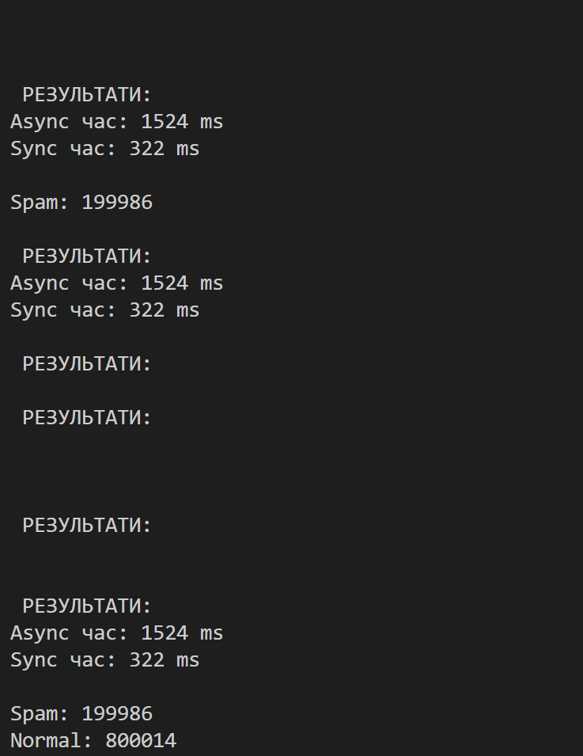

# Лабораторна робота №29  
## Асинхронне читання великих файлів.
##  Мета
Ознайомитися з асинхронним потоковим читанням та записом файлів у C#.
##  Варіант 12: Повідомлення (фільтр спаму)
##  Функціонал
- Генерація файлу (1 000 000 рядків)
- Асинхронне читання (StreamReader)
- Обробка кожного рядка
- Фільтрація spam
- Асинхронний запис
- Порівняння продуктивності
##  Результат
Async швидше за Sync  
Пам’ять не перевантажується (читання построчно)
##  Висновок
Асинхронне читання дозволяє ефективно працювати з великими файлами без блокування потоку.

