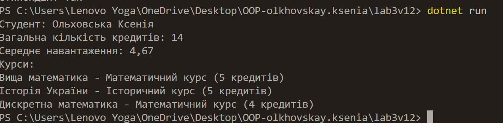

# OOP-<Прізвище> / lab3vN

## Тема та мета роботи
Лабораторна робота №3. Наслідування. Варіант №12
Мета роботи — реалізувати консольний застосунок мовою C# з використанням принципів об’єктно-орієнтованого програмування.  
Завдання: змоделювати студента та його курси, надати можливість обчислювати загальну й середню кількість кредитів.

## Опис виконання завдання
У програмі створено такі класи:

- **`Course`** — базовий клас, що містить назву курсу та кількість кредитів, а також метод `GetCourseType()` для визначення типу курсу.  
- **`MathCourse`** та **`HistoryCourse`** — класи-нащадки, які перевизначають метод `GetCourseType()` відповідно до типу курсу.  
- **`Student`** — клас для збереження інформації про студента (ПІБ, список курсів) та обчислення:
  - загальної кількості кредитів (`TotalCredits()`),
  - середнього навантаження на курс (`AverageCredits()`).

У методі `Main()` створюється об’єкт студента, додаються кілька курсів та відображаються результати обчислень.

