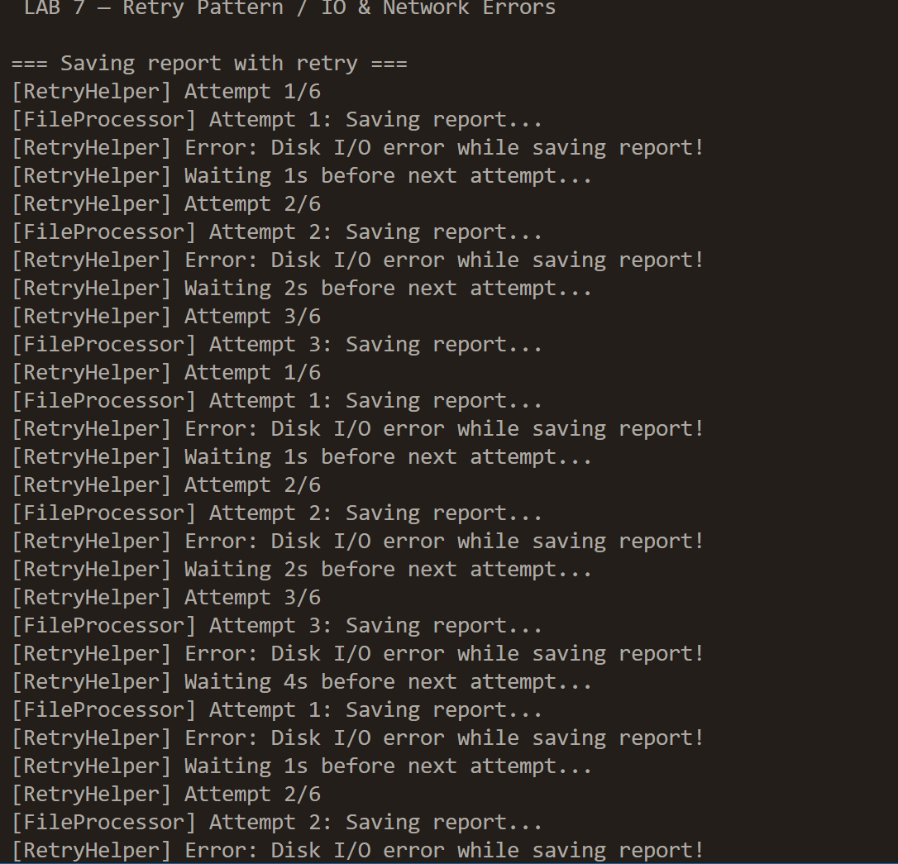
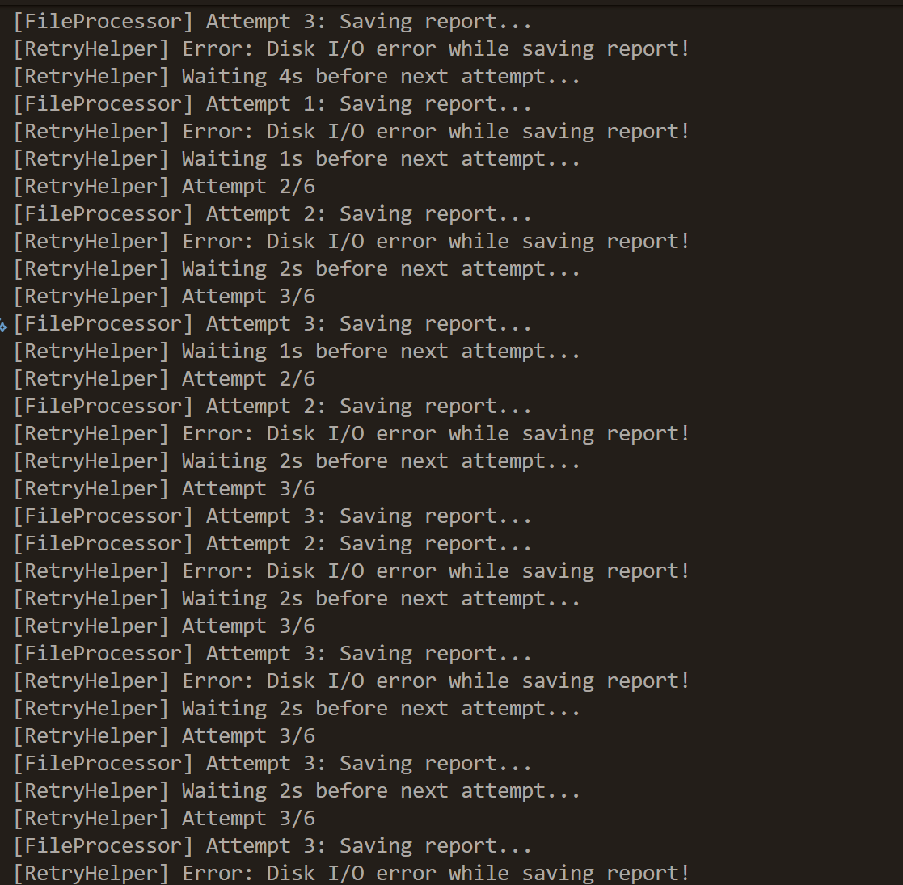
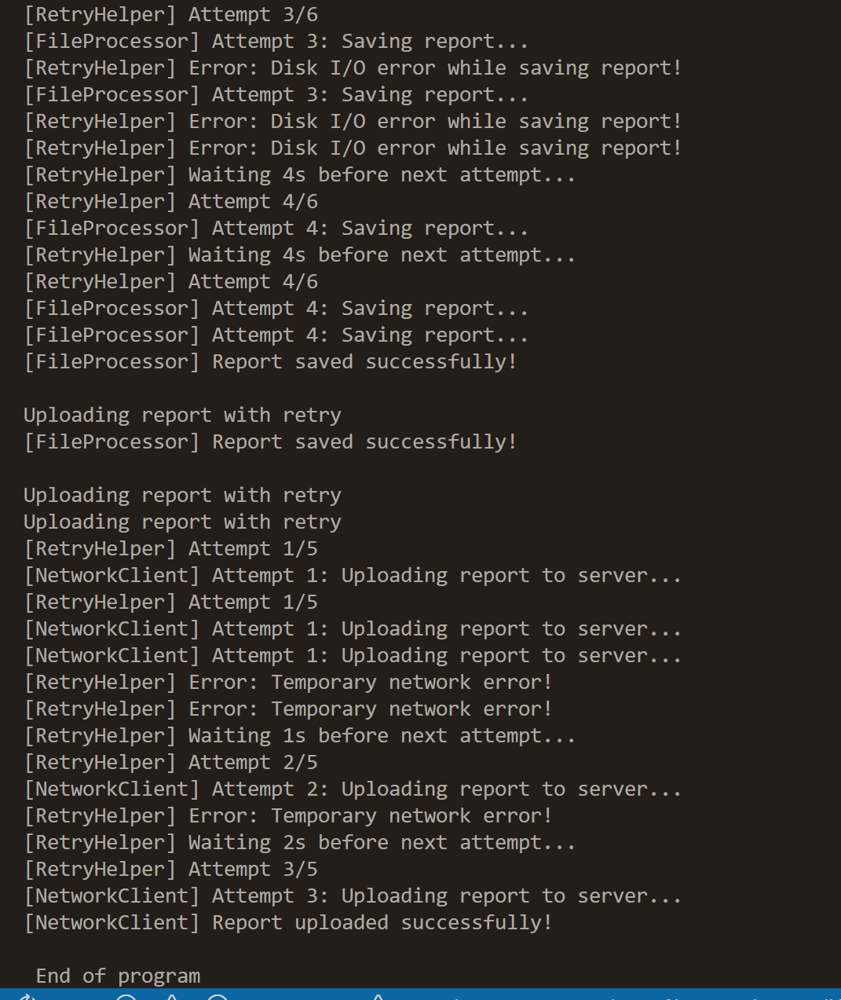

Лабораторна робота №7
Тема: Обробка IO/мережевих помилок та патерн Retry.
Мета: Навчитися обробляти типові помилки вводу/виводу та мережеві помилки за допомогою блоків try-catch-finally, а також реалізувати патерн Retry для підвищення відмовостійкості застосунків.
## Реалізовані класи

### FileProcessor  
Метод `SaveReport(path, content)`  
- 3 рази імітує `IOException`,  
- потім успішно зберігає файл.

### NetworkClient  
Метод `UploadReport(url, content)`  
- 2 рази імітує `HttpRequestException`,  
- потім успішно завантажує звіт.

###  RetryHelper  
Універсальний клас з методом
## Контрольні питання

### 1. Які типи винятків найчастіше виникають при роботі з файлами та мережею?

**Файли:**
- `FileNotFoundException`
- `DirectoryNotFoundException`
- `IOException`
- `UnauthorizedAccessException`

**Мережа:**
- `HttpRequestException`
- `SocketException`
- `TimeoutException`
---
### 2. Поясніть принцип роботи патерну Retry. Коли його доцільно використовувати?
**Retry** — це повторення операції, яка може тимчасово провалитися.  
Застосовується, коли є шанс, що операція з часом успішно виконається:

- нестабільна мережа  
- тимчасово недоступний API  
- тимчасова помилка файлової системи  
- короткочасні збої бази даних  

Не варто використовувати для постійних помилок (наприклад, неправильний файл чи URL).
---
### 3. Як реалізувати експоненційну затримку між повторними спробами?
Формула:
delay = initialDelay * 2^(attempt - 1)
yaml
Копіювати код
Приклад:
- 1s  
- 2s  
- 4s  
- 8s  

---

### 4. Для чого потрібен делегат shouldRetry?

`shouldRetry(Exception ex)` визначає, **чи потрібно робити повторну спробу для конкретного типу винятку**.

Наприклад:
IOException → retry
HttpRequestException → retry
ArgumentException → no retry

yaml

Це дозволяє контролювати логіку повторення.

---

## Висновки

У роботі реалізовано:
- Обробку IO та мережевих винятків  
- Узагальнений Retry з експоненційною затримкою  
- Імітацію тимчасових збоїв  
- Контроль за тим, які винятки допускають повторення  

Результат — застосунок більш **стійкий до тимчасових помилок**, що важливо для реальних 
## Отримані результати

